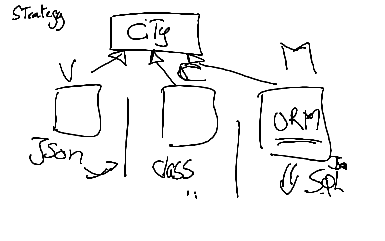

# ORM 

## Definition

ORM (Object Relational Mapping)


Créer un répertoire avec votre identifiant

* Slick

creér un répertoire `backend`  

cloner le projet suivant

```
$ git clone https://github.com/playframework/play-scala-slick-example.git
```

supprimer le répertoire .git

* angular-cli

au même niveau que vtore répertoire ID étudiant  

Créer un répertoire `frontend`

```
$ ng new frontend
```


## pattern

* Strategy



## Deploiement

* sbt deploy

- utiliser sbt native packager

https://github.com/sbt/sbt-native-packager

- pour créer un image

```
$ sbt docker:publishLocal
```

* docker-compose


docker-compose.yml
```yml
version: '2'

services:
   webapp:
     image: play-slick-example:1.0-SNAPSHOT
     ports:
       - "9000:9000"
     depends_on:
       - db

   db:
     image: mysql
     environment:
      - MYSQL_ROOT_PASSWORD=password

```

* SSL

https://letsencrypt.org/
