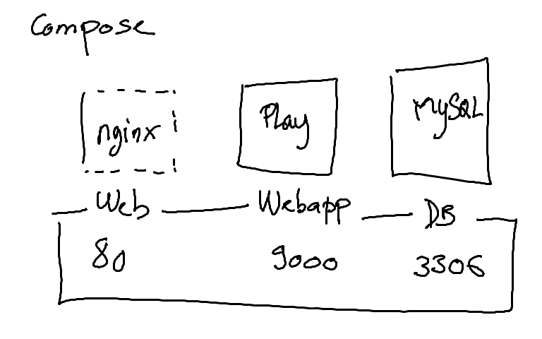

# ORM 

## Swagger API  
* Afficher les APIs d'une belle manière

https://github.com/iheartradio/play-swagger

## Créer un forme en Angular2

### Template Driven Forms
https://scotch.io/tutorials/using-angular-2s-template-driven-forms

### Model Driven Forms
https://scotch.io/tutorials/using-angular-2s-model-driven-forms-with-formgroup-and-formcontrol

## Definition

ORM (Object Relational Mapping)


Créer un répertoire avec votre identifiant

* Slick

creér un répertoire `backend`  

cloner le projet suivant

```
$ git clone https://github.com/playframework/play-scala-slick-example.git
```

supprimer le répertoire .git

* angular-cli

au même niveau que vtore répertoire ID étudiant  

Créer un répertoire `frontend`

```
$ ng new frontend
```


## pattern

* Strategy


## Deploiement

* sbt deploy

- utiliser sbt native packager

https://github.com/sbt/sbt-native-packager

- Modifier application.conf  
  **  play.crypto.secret="IN_PRODUCTION_CHANGE_THIS_TO_A_LONG_RANDOM_STRING"

```
$ sbt playGenerateSecret
```


- pour créer un image

```
$ sbt docker:publishLocal
```

* docker-compose



docker-compose.yml
```yml
version: '2'

services:
   webapp:
     image: play-slick-example:1.0-SNAPSHOT
     ports:
       - "9000:9000"
     depends_on:
       - db

   db:
     image: mysql
     environment:
      - MYSQL_ROOT_PASSWORD=password

```


* Slick

slick.dbs
{
default.driver = "slick.driver.MySQLDriver$"
default.db.driver = "com.mysql.jdbc.Driver"
default.db.url =   "jdbc:mysql://db:3306/Persons""
default.db.user =  "etudiants"
default.db.password = "etudiants_1"
default.db.connectionTimeout= 30s
}

* SSL

https://letsencrypt.org/
